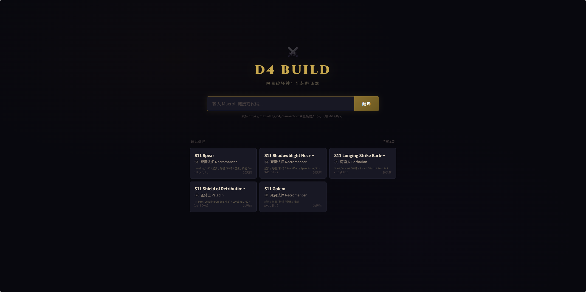
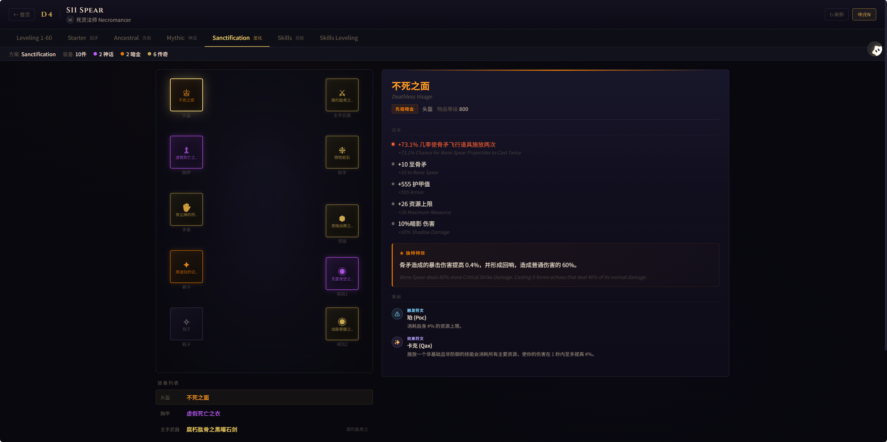
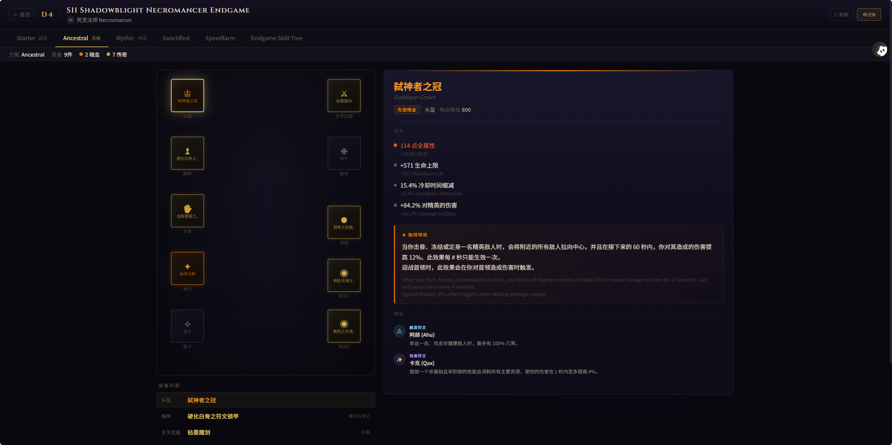
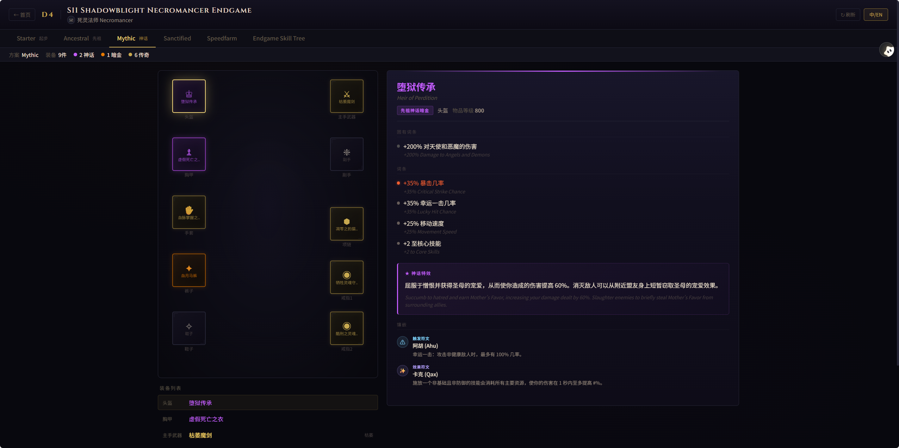
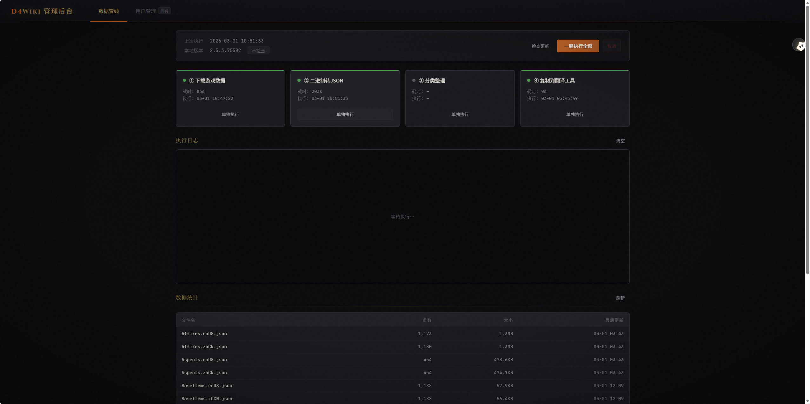

# D4WikiCN

> 把 Maxroll Planner 英文配装链接翻译成与国服《暗黑破坏神 IV》客户端术语一致的中文结果。



## 项目定位

这个项目做的不是普通机翻，而是“**基于暴雪官方本地化数据的术语映射**”。

你输入一个 Maxroll Planner 链接，工具会：

- 从 Maxroll 拉取 build 数据
- 用游戏内 `nid` / `SNO` 对应到官方中英文本地化条目
- 按国服术语生成中文装备、词条、传奇特效和暗金特效
- 输出可读的文本结果，或通过 Web / API 返回结构化数据

如果你的目标是做：

- 暗黑 4 中文攻略翻译
- 国服术语对照工具
- 基于官方文本的数据站/配装站
- 自动更新的暗黑 4 数据管线

这个仓库已经把最难啃的“数据层”和“术语准确性”打通了。

## 这个项目的价值

同类工具常见的问题是“能看懂，但和游戏里写的不一样”。这个项目的重点正好相反：

- 术语来源是暴雪官方本地化文件，不是 AI 意译
- 传奇特效、暗金特效、词条名会尽量对齐国服客户端
- 数据可以在游戏更新后通过管线快速刷新，不依赖第三方维护者长期同步
- 已经打通 Maxroll Planner -> 本地数据库 -> 中文输出 这一整条链路

简单说，它更像一个“暗黑 4 中文本地化中间层”，而不只是一个网页翻译器。

## 当前已实现

- Maxroll Planner build 抓取
- 装备名称翻译
- 词条翻译与数值填充
- 传奇特效翻译与描述填充
- 暗金 / 神话暗金名称与特效翻译
- 传奇装备中文命名拼装（特效名 + 基底名）
- 宝石 / 符文显示
- 命令行输出
- FastAPI Web 服务
- 浏览器前端页面
- 管理后台与数据更新管线

效果示例：

**传奇装备**



**先祖暗金装备**



**神话暗金装备**



**数据管线后台**



## 仍然不算完成的部分

目前仓库更接近“可运行的工程原型”，还不是面向普通玩家的成品：

- 前端可用，但产品打磨不足
- 主要支持装备相关翻译，技能 / 巅峰内容仍不完整
- 当前只接入 Maxroll Planner
- 部署、权限、用户系统都还没做成正式产品形态

如果你是开发者，这通常不是问题；如果你想直接拿来给大量普通用户使用，还需要继续做产品层工作。

## 项目结构

```text
d4wikicn/
├── server.py               # FastAPI 统一入口
├── api.py                  # 对外翻译 API（SSE）
├── web/                    # 用户端页面
├── admin/                  # 数据管线后台与管理 API
├── src/
│   ├── main.py             # CLI 入口
│   ├── maxroll_api.py      # Maxroll 数据获取
│   ├── data_loader.py      # 本地 JSON 数据加载
│   ├── translator.py       # 翻译核心
│   ├── formatter.py        # 文本 / Markdown 输出
│   └── export_json.py      # JSON 导出
├── data/raw/               # 翻译所需原始数据
├── scripts/                # 辅助脚本
└── docs/screenshots/       # README 截图
```

## 工作流程

```text
Maxroll Planner URL
    -> maxroll_api.py 获取 build
    -> data_loader.py 加载本地中英对照数据
    -> translator.py 按 nid / SNO 匹配官方文本
    -> formatter.py / export_json.py 输出结果
```

核心点在于：Maxroll 返回的是游戏内部标识与数值，项目再把这些标识映射到暴雪官方中英文文本，从而得到真正“和游戏里一致”的中文描述。

## 快速开始

### 1. 环境

运行翻译工具本体至少需要：

- Python 3.10+
- `fastapi`
- `uvicorn`

安装示例：

```bash
pip install fastapi uvicorn
```

### 2. 命令行使用

```bash
cd d4wikicn
python -m src.main https://maxroll.gg/d4/planner/x61ej0y7
```

运行后会：

- 获取 build 数据
- 翻译当前 build
- 在终端输出文本结果
- 额外生成 `output.md`

### 3. 启动 Web 服务

```bash
cd d4wikicn
python server.py
```

启动后可访问：

- 用户页面：`http://localhost:8000/`
- 管理后台：`http://localhost:8000/admin/`

### 4. 调用 API

当前对外翻译接口是 SSE 形式：

```text
GET /api/translate/{build_id}
```

示例：

```bash
curl http://localhost:8000/api/translate/x61ej0y7
```

接口会逐步推送：

- `progress`：下载/翻译进度
- `profile`：单个方案的翻译结果
- `complete`：全部结束
- `fail`：错误信息

## 数据来源与稀缺点

仓库里最有价值的部分，其实是数据链路。

项目不是依赖某个社区维护的映射表，而是从暴雪游戏数据中提取官方中英文文本，再整理成程序可直接使用的 JSON。这样做的好处是：

- 术语准确
- 自主可控
- 游戏版本更新后可快速刷新
- 不会被第三方数据站的维护节奏卡住

### 数据管线概览

```text
暴雪游戏服务器
    -> 下载 .dat 文件
    -> 二进制解析为 JSON
    -> 分类整理成可用数据文件
    -> 放入 d4wikicn/data/raw/
```

当前使用的数据文件包括：

- `Affixes.*.json`：词条
- `Aspects.*.json`：传奇特效
- `Uniques.*.json`：暗金 / 神话暗金
- `Runes.*.json`：符文
- `Sigils.*.json`：梦魇印记
- `ItemTypes.*.json`：装备类型
- `ParagonBoards.*.json`：巅峰面板
- `ParagonGlyphs.*.json`：巅峰雕文
- `BaseItems.*.json`：装备基底名
- `StaticValues.json`：固定数值占位

## 数据更新

如果游戏版本更新，需要刷新本地数据，可以使用管理后台的一键管线，或者手动执行下载/解析/整理流程。

这条管线依赖额外工具，主要包括：

- `CASCExplorer / CASCConsole`
- `d4data`
- `D4DataParser`

仓库中已经保留了相关参考资源与改造思路，核心目标是把“官方二进制文本”变成 `data/raw/` 下可直接消费的 JSON 数据。

如果你只是想运行翻译功能，不需要先理解完整管线；只要仓库里的 `data/raw/` 已经存在，就可以直接使用。

## 适合谁继续做

这个仓库很适合继续往下延伸成这些方向：

- 更完整的暗黑 4 中文资料站
- 攻略站英文内容自动汉化
- 多来源 build 聚合器
- 国服术语校对 / 差异比对工具
- 自动化数据更新服务

## 已知限制

- 只完整覆盖了当前这套翻译主链路
- 技能、巅峰等内容还有继续完善空间
- 目前只支持 Maxroll Planner
- 部分外部工具仓库需要手动维护或自行更新
- 游戏数据版权归暴雪娱乐所有

## License

仓库中的 `d4wikicn/` 代码按 MIT 使用意图编写。

第三方工具与资源请分别遵循原项目许可证或使用条款：

- `d4data`：MIT
- `D4DataParser`：MIT
- `CASCExplorer`：请以原仓库说明为准

## 致谢

- [Maxroll.gg](https://maxroll.gg/d4)
- [WoW-Tools/CASCExplorer](https://github.com/WoW-Tools/CASCExplorer)
- [DiabloTools/d4data](https://github.com/diablo-tools/d4data)
- [josdemmers/D4DataParser](https://github.com/josdemmers/D4DataParser)

## 说明

原作者已经不再继续投入这个项目，但这个仓库留下的核心价值依然很明确：

它证明了“**直接基于官方本地化数据，构建暗黑 4 中文术语翻译链路**”这件事是可行的，而且已经有一套能跑通的实现。

如果你正好想做这件事，这个仓库应该能帮你省下很多前期摸索时间。
